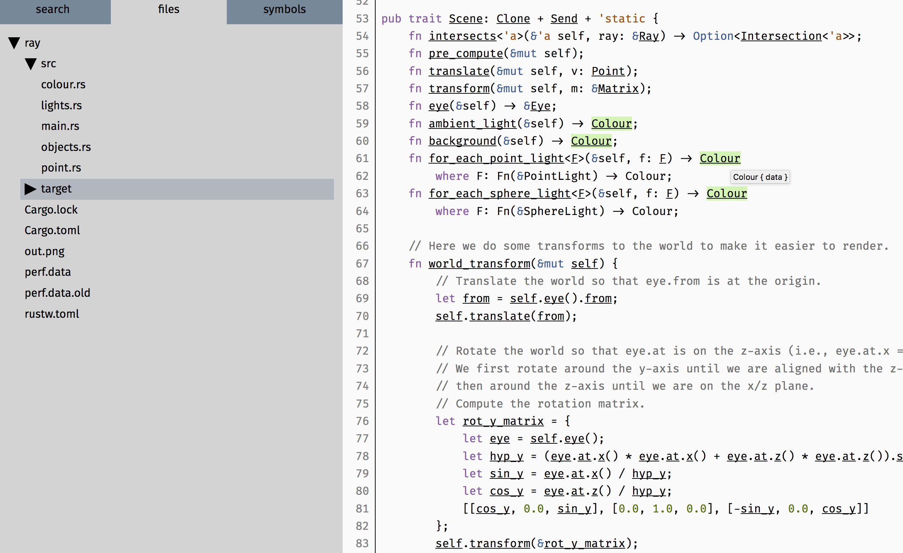
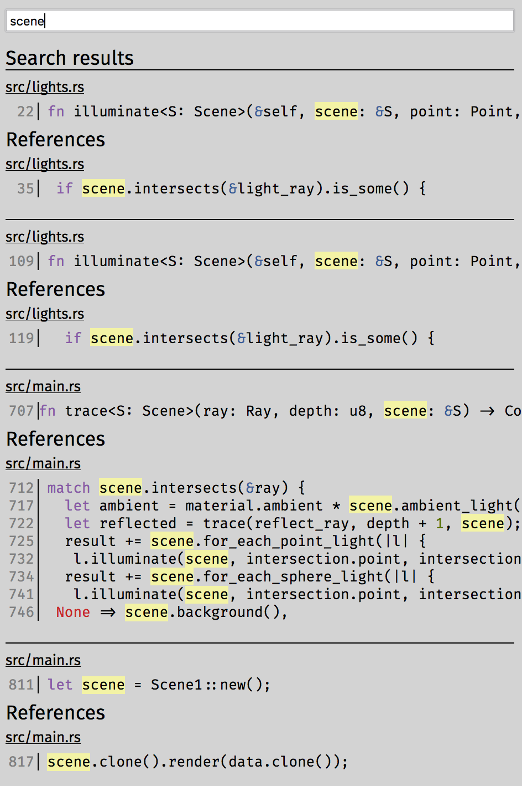
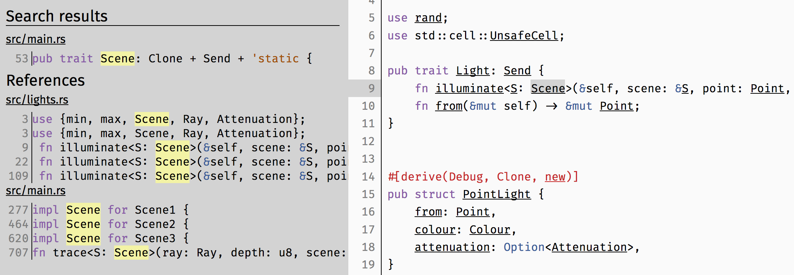
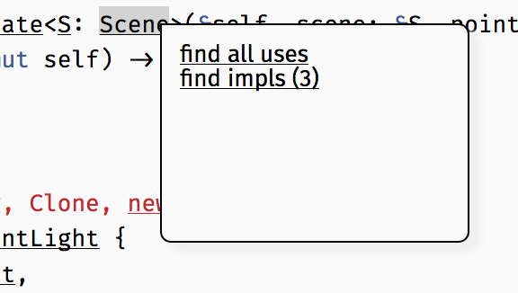

# cargo src

[](https://travis-ci.org/nrc/cargo-src)

A Rust source browser. Explore your Rust project with semantic understanding of
the code. Features:

* syntax highlighting
* jump to def (click on a reference)
* find all references (click on a definition)
* smart identifier search
* types (and field info) on hover
* smart usage highlighting
* find all impls (right click on a type or trait name)
* jump to docs for standard library references
* directory browsing
* symbol browsing

Uses knowledge from the RLS.

This is work-in-progress, pre-release software, expect bugs and plenty of rough
edges.

## Contents:

* [Installing and running](#installing)
* [Customisation](#customisation)
* [Building](#building)
* [Contributing](#contributing)

### Screen shots



### Hover to show the type of an identifier:


### Search for an identifier name (shows definitions, and all references to each definition):



### Find all uses of a definition:



### Right click an identifier to show more options




## Installing and running

Requires a nightly version of Rust.

To install, run `cargo install cargo-src`.

Then, to run: `cargo src` in a directory where you would usually run `cargo build`.
You can run `cargo src --open` to open the output of `cargo src` directly in your
web browser.

`cargo src` will start a web server and build (`cargo check`) and index your code.
This may take some time (depending on your crate, up to twice as long as a normal
build). You can browse the source in whilst indexing, but you'll be missing all
the good stuff like jump-to-def and search.


## Customisation

Create a `rustw.toml` file in your project's directory. See [src/config.rs](src/config.rs)
or run `cargo src -- -h` for the options available and their defaults.

Some features **need** configuration in the rustw.toml before they can be
used.

```
edit_command = "subl $file:$line"
```

To be able to open files in your local editor. This example works for sublime
text (`subl`). Use the `$file` and `$line` variables as appropriate for your
editor.

```
vcs_link = "https://github.com/nrc/rustw-test/blob/master/$file#L$line"
```

For links to the code in version control, GitHub, in the example.


## Building and running

Requires a nightly version of Rust.

Get the source code from https://github.com/nrc/cargo-src.

* Install the dependencies: `npm install` or `yarn`
* Build the JS components: `npm run build` or `yarn build`
* Build the Rust parts: `cargo build --release`

### Running

Run `CARGO=cargo /<your local filepath>/rustw/target/release/cargo-src` in your
project's directory (i.e., the directory you would normally use `cargo build`
from).

Running `cargo src` will start a web server and display a URL in the console. To
terminate the server, use `ctrl + c`. If you point your browser at the provided
URL, it will list the directories and files from your project, which you can then
use to view the code. The terminal is only used to display logging, it can
be ignored.

You can use `--open` to open the cargo src browser directly in your web browser.

Currently, cargo src has only been tested on Firefox on Linux and MacOS
([issue 48](https://github.com/nrc/cargo-src/issues/48)).


### Troubleshooting

If you get an error like `error while loading shared libraries` while starting
up cargo src you should try the following:

On Linux:

```
export LD_LIBRARY_PATH=$(rustc --print sysroot)/lib:$LD_LIBRARY_PATH
```

On MacOS:

```
export DYLD_LIBRARY_PATH=$(rustc --print sysroot)/lib:$DYLD_LIBRARY_PATH
```

## Contributing

Cargo src is open source (dual-licensed under the Apache 2.0 and MIT licenses)
and contributions are welcome! You can help by testing and
[reporting issues](https://github.com/nrc/cargo-src/issues/new). Code, tests, and
documentation are very welcome, you can browse [all issues](https://github.com/nrc/cargo-src/issues)
or [easy issues](https://github.com/nrc/cargo-src/issues?q=is%3Aopen+is%3Aissue+label%3Aeasy)
to find something to work on.

If you'd like help or want to talk about cargo, you can find me on the
rust-dev-tools irc channel (nrc), email (my irc handle @mozilla.com), or
twitter ([@nick_r_cameron](https://twitter.com/nick_r_cameron)).

The cargo src server is written in Rust and uses Hyper. It runs `cargo check` as
a separate process and only really deals with output on stdout/stderr.

The cargo src frontend is a single page web app written in HTML and Javascript. It
uses React and JQuery.
